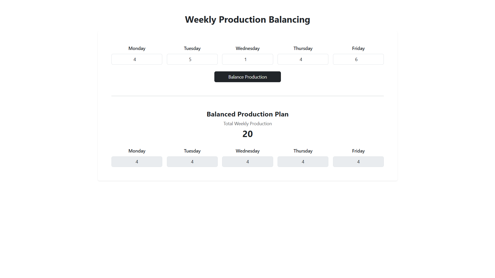
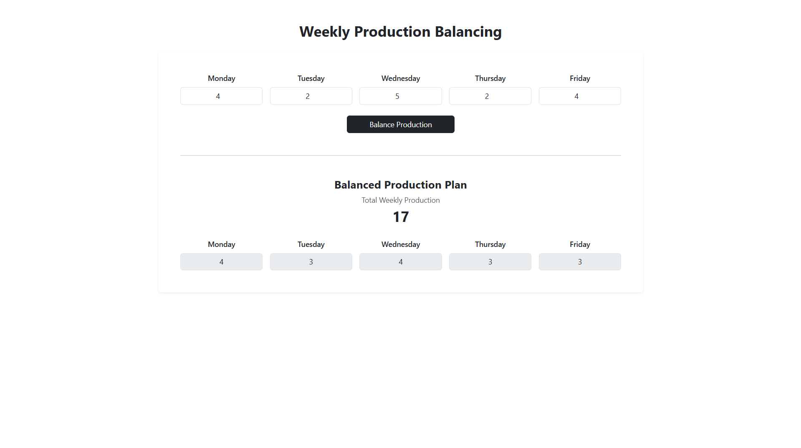
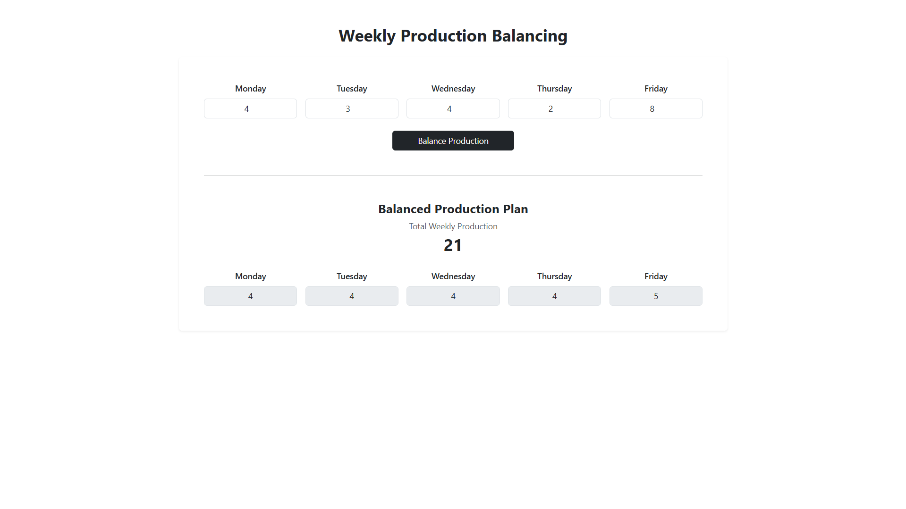
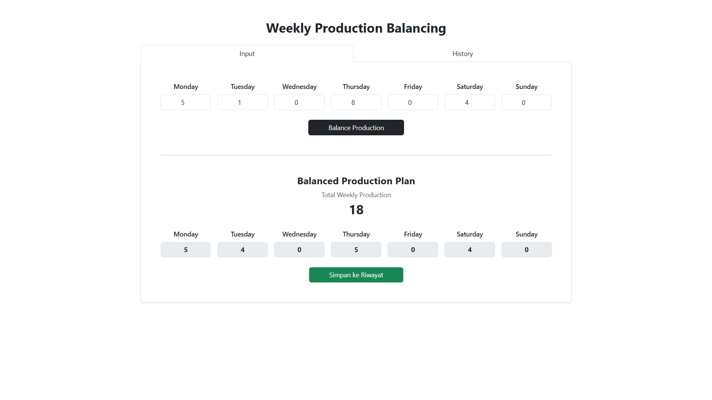
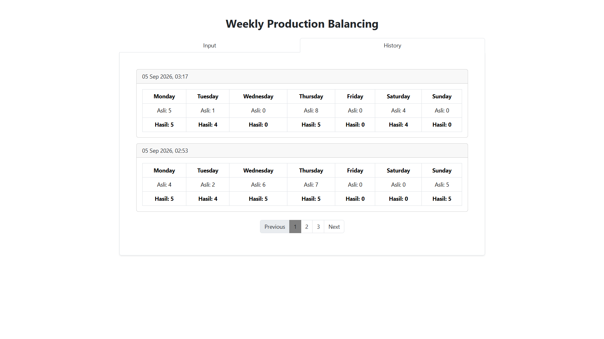
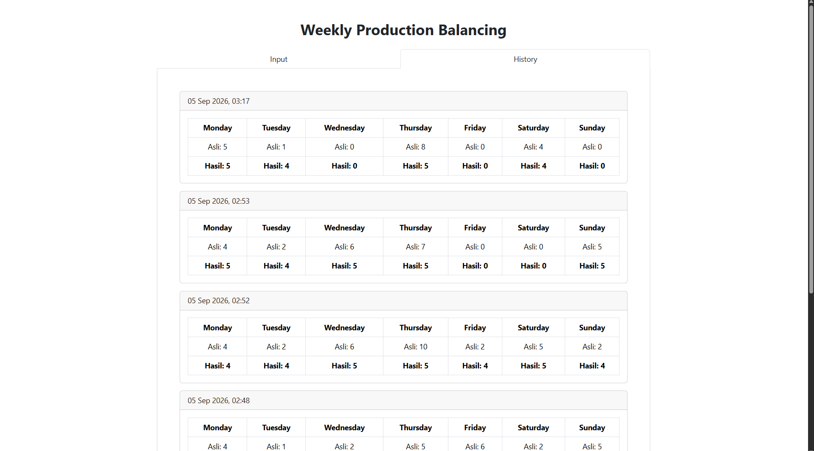
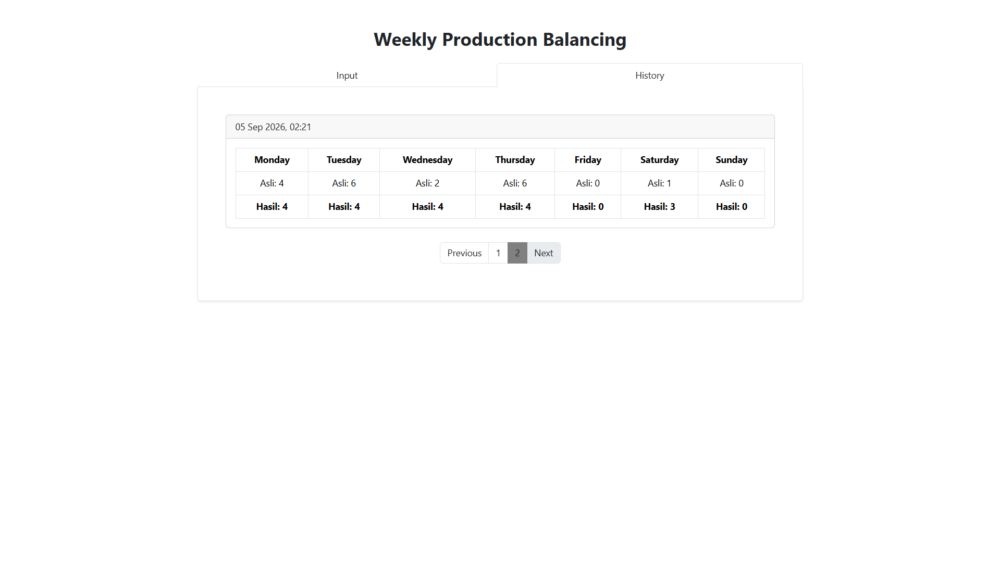
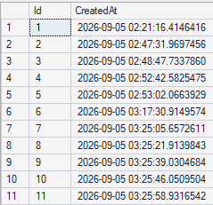
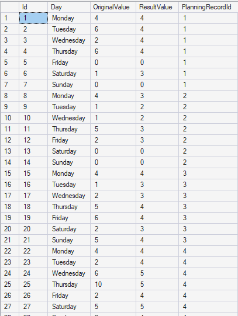
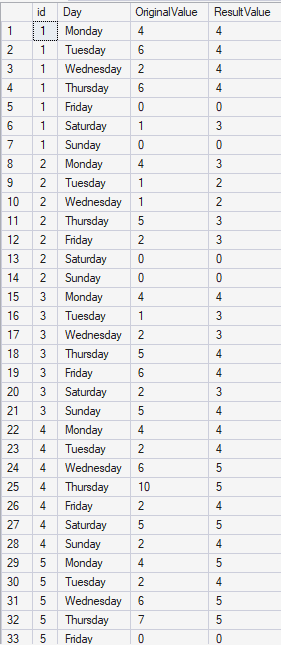

# TEST SOFTWARE ENGINEER

## Task 1 : Permasalahan Asep

### 1. Solusi yang Diusulkan

Saya mengusulkan sebuah aplikasi web sederhana untuk Asep. Asep cukup menginput rencana produksi hariannya, lalu aplikasi akan otomatis memproses rencana tersebut agar sesuai dengan ekspektasi atasannya.

atasan Asep ingin rencana produksi merata di setiap hari. Jika tidak bisa merata secara menyeluruh, maka sisa produksi diprioritaskan untuk hari-hari dengan rencana awal terbesar (sesuai urutan rencana yang sudah dibuat Asep).

Logika penyelesaiannya:
1. Jumlahkan seluruh rencana produksi Asep dalam seminggu.
2. Bagi total tersebut secara rata ke seluruh hari kerja untuk mencari rata2 produksi per hari.
3. Jika ada sisa pembagian (karena total tidak habis dibagi rata), sisa tersebut dibagikan +1 ke hari-hari dengan rencana awal terbesar, sejumlah sisa yang ada.
4. Hari dengan rencana awal terkecil tetap mendapat nilai dasar tanpa tambahan.

### 2. Aplikasi

Pada aplikasi ini, Asep cukup menginput jumlah produksi pada kolom hari yang sudah disediakan (Senin–Jumat). Saat tombol **"Balance Production"** ditekan, aplikasi akan menampilkan kolom-kolom baru berisi hasil konversi rencana produksi sesuai ketentuan di atas.

**Contoh Alur Penggunaan:**
1. Asep membuka halaman utama aplikasi dan mengisi rencana produksi mingguan.
2. Asep menekan tombol **Balance Production**.
3. Aplikasi menampilkan hasil rencana produksi yang sudah merata, lengkap dengan total produksi mingguan sebagai validasi bahwa totalnya tidak berubah.

**Screenshot:**

---

## Task 2 : Penyimpanan Rencana Produksi ke Database

### 1. Permasalahan Tambahan

Setelah melihat aplikasi Task 1, atasan Asep memberikan dua permintaan tambahan:
1. Hari dengan planning 0 berarti hari libur (tidak ada produksi), sehingga hari tersebut tidak boleh ikut dapat bagian dan harus tetap bernilai 0 pada hasil akhir.
2. Selain Senin–Jumat, Asep terkadang juga bekerja di hari Sabtu/Minggu, sehingga aplikasi perlu mendukung input untuk 7 hari (Senin s.d. Minggu), bukan hanya 5 hari kerja.

Selain itu, seluruh rencana produksi (baik input asli maupun hasil balancing) perlu disimpan ke database SQL Server, dan bisa ditampilkan kembali di halaman web sebagai riwayat.

### 2. Penyesuaian

Logika dari Task 1 disesuaikan dengan menambahkan satu langkah di awal: hari dengan nilai input 0 dikecualikan dari perhitungan total dan pembagian rata — nilainya tetap 0 di hasil akhir dan tidak ikut mengambil porsi sisa pembagian. Enam hari lainnya (termasuk Sabtu/Minggu jika diisi) diproses dengan logika yang sama seperti Task 1.

### 3. Desain Database

Data disimpan dalam dua tabel dengan relasi one-to-many, agar satu kali proses "balancing" (1 transaksi) bisa menyimpan 7 data harian sekaligus:

*tabel planning record berperan sebagai header*

*sedangkan tabel planning day record menyimpan rincian per-hari*

### 4. Alur Aplikasi

Aplikasi dirancang dengan 2 tab pada satu halaman:

**Tab Input** — tempat Asep menginput rencana produksi 7 hari, memproses balancing, lalu menyimpan hasilnya.
1. Asep mengisi form 7 hari, lalu menekan **Balance Production**.
2. Aplikasi menampilkan hasil balancing di bawah form.
3. Asep menekan tombol **Simpan ke Riwayat** untuk menyimpan input asli dan hasil balancing ke database.
4. Setelah tersimpan, muncul notifikasi sukses dan form kembali kosong, siap untuk input baru.

**Tab History** — menampilkan seluruh riwayat transaksi yang tersimpan di database, dengan pagination di sisi server (5 data per halaman) agar performa tetap ringan meskipun data bertambah banyak.

### 5. Data di Database

### 6. File yang Dilampirkan

- Source code aplikasi (folder 'aplikasi-asep')
- Backup database SQL Server (file 'aplikasi_asep_db.bk')